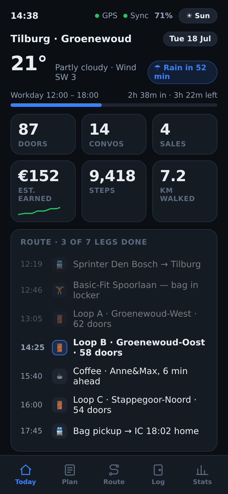
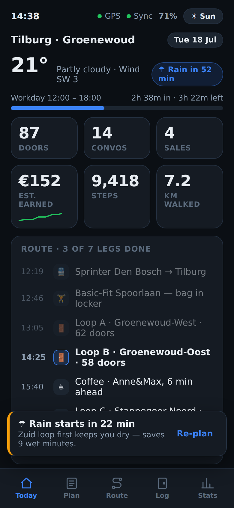
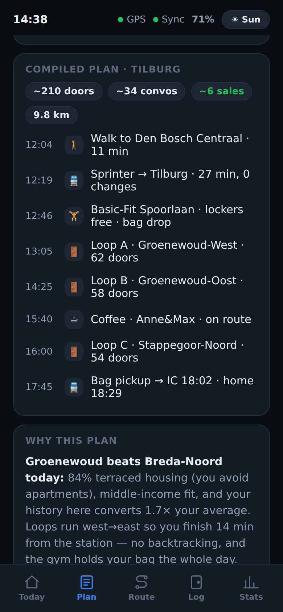
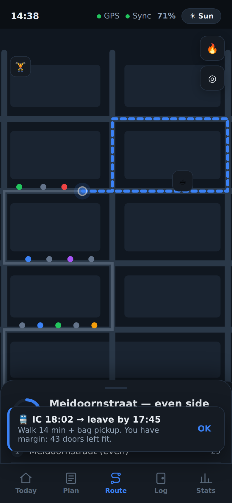
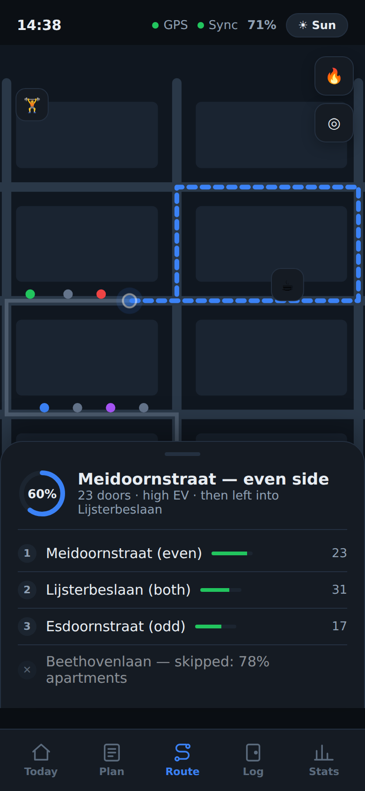
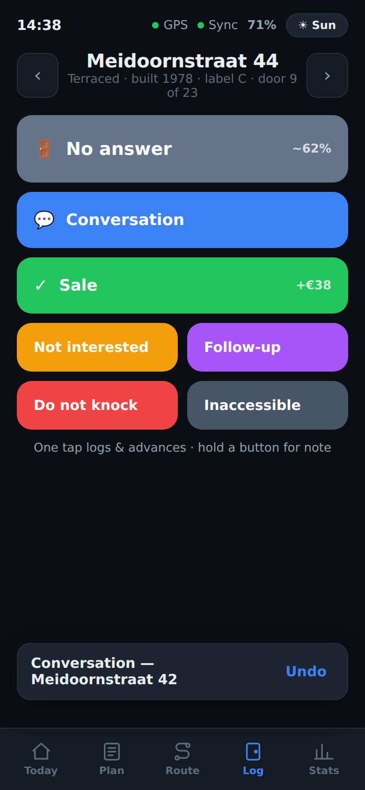
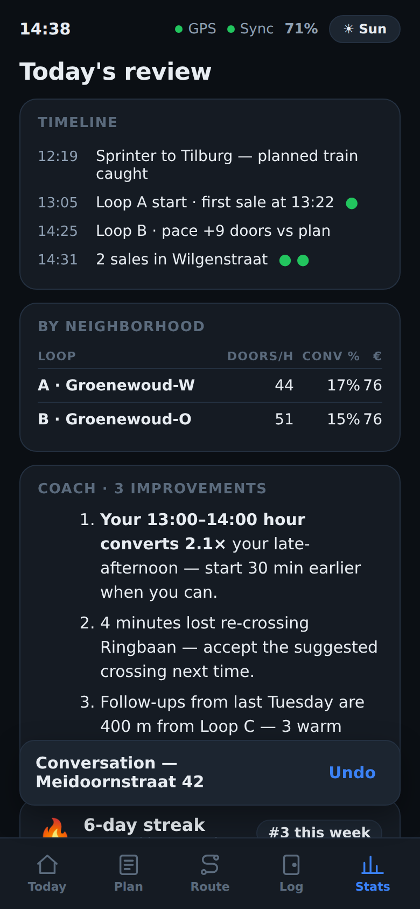
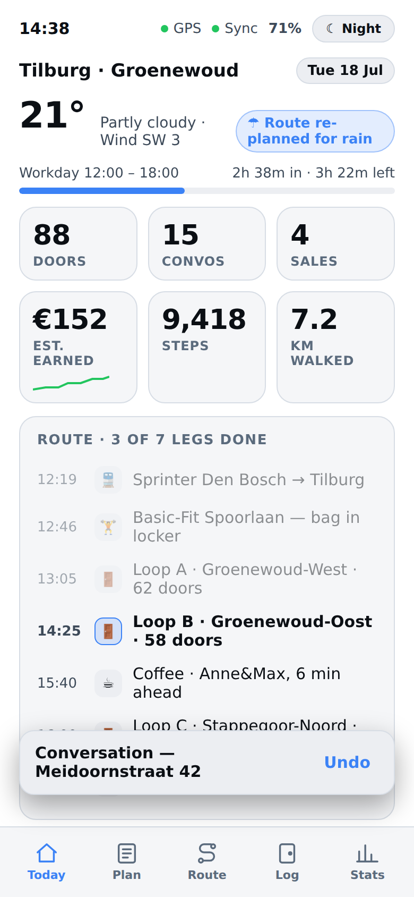
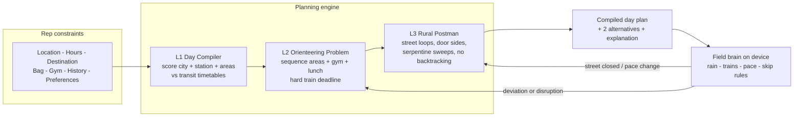
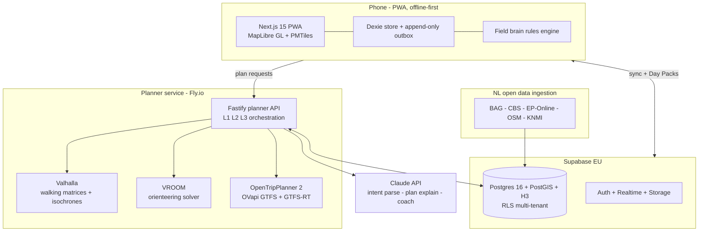

<p align="center">
  
</p>

<p align="center">
  
  
  
  
</p>

**2DAY** compiles a door-to-door sales rep's real constraints — current location, end
destination, work hours, train times, bag size, gym membership, sales history, walking and
neighborhood preferences — into the most efficient possible sales day, then keeps re-optimizing
it live as rain rolls in, trains delay, and doors get knocked.

Not a CRM. Not a navigation app. A **real-time field optimization platform** whose unit of
output is a *productive conversation*: plan in 30 seconds, drop the bag at a Basic-Fit near the
station, walk loops that never backtrack, log every door in one tap, and always catch the right
train home.

---

## The product, in eight screens

Captured from the interactive prototype in this repo (`prototype/index.html`) — open it on a
phone or at a ~400 px viewport and click through the whole day yourself.

| Today — the instrument panel | Rain nudge, 22 min out | Plan — a compiled day | Route — live loop + train nudge |
|---|---|---|---|
|  |  |  |  |

| Street queue, EV-ranked | Log — one tap per door | Stats — review + coach | Sunlight mode |
|---|---|---|---|
|  |  |  |  |

Design system: **Fieldkit** — dark-first "Night", AAA-contrast "Sun" for direct sunlight, one
outcome color code used identically across log buttons, map dots, heat layers and charts.
Full rationale in [doc 07](docs/07-ui-concepts.md).

## How it thinks

Three optimization levels, each a known problem class — the LLM never computes routes
("compiler, not oracle", [doc 10](docs/10-ai-architecture.md)):



Every knock feeds an expected-value model (`P(answer) x P(conversation) x P(sale) x commission`
with Bayesian shrinkage and 90-day decay) that makes tomorrow's plan smarter than today's —
the data moat compounds street by street. Math and pseudocode: [doc 11](docs/11-routing-algorithms.md).

## System architecture



Full service topology, endpoint catalog and typed `PlanRequest`: [doc 09](docs/09-api-architecture.md).

## A compiled day (the hero scenario)

> Rep in **Maaspoort, Den Bosch** · must end in **Tilburg** · works **12:00–18:00** · train +
> backpack + Basic-Fit · normal pace · middle-income areas · goal: **max sales**

| | | |
|---|---|---|
| 12:04 | 🚶 | Walk to Den Bosch Centraal — 11 min |
| 12:19 | 🚆 | Sprinter → Tilburg — 27 min, 0 changes |
| 12:46 | 🏋️ | Basic-Fit Spoorlaan — lockers free, **bag drop** |
| 13:05 | 🚪 | Loop A · Groenewoud-West — 62 doors, both sides serpentine |
| 14:25 | 🚪 | Loop B · Groenewoud-Oost — 58 doors |
| 15:40 | ☕ | Coffee on route — Anne&Max |
| 16:00 | 🚪 | Loop C · Stappegoor-Noord — 54 doors |
| 17:45 | 🚆 | Bag pickup → **IC 18:02**, home 18:29 |

~210 doors · ~34 conversations · ~6 expected sales · 9.8 km — and when the rain nowcast says
22 minutes, the loops reorder themselves. Step-by-step walkthrough: [doc 03](docs/03-user-journeys.md).

## Built on open source

2DAY deliberately assembles proven open-source components instead of reinventing them — the
entire routing/geo/transit stack is OSS, which is also what makes the unit economics work
([doc 18](docs/18-cost-estimates.md)):

| Component | Role in 2DAY | Source |
|---|---|---|
| [MapLibre GL JS](https://github.com/maplibre/maplibre-gl-js) | Vector map rendering on device | BSD-3 |
| [Protomaps / PMTiles](https://github.com/protomaps/PMTiles) | Single-file map tiles; offline Day Pack extracts | BSD-3 |
| [Valhalla](https://github.com/valhalla/valhalla) | Pedestrian routing, time matrices, isochrones | MIT |
| [VROOM](https://github.com/VROOM-Project/vroom) | Vehicle-routing/orienteering solver behind L2 | BSD-2 |
| [OpenTripPlanner 2](https://github.com/opentripplanner/OpenTripPlanner) | Multimodal transit planning over GTFS | LGPL |
| [H3](https://github.com/uber/h3) | Hexagonal spatial index for density/EV scoring | Apache-2.0 |
| [PostGIS](https://github.com/postgis/postgis) | Spatial truth in Postgres | GPL-2 |
| [Supabase](https://github.com/supabase/supabase) | Auth, Postgres platform, Realtime, RLS | Apache-2.0 |
| [Dexie.js](https://github.com/dexie/Dexie.js) | IndexedDB store for the offline-first client | Apache-2.0 |
| [Turf.js](https://github.com/Turfjs/turf) | Client-side geometry ops | MIT |
| [Workbox](https://github.com/GoogleChrome/workbox) | Service-worker caching strategies | MIT |
| [Fastify](https://github.com/fastify/fastify) | Planner service HTTP layer | MIT |
| [Next.js](https://github.com/vercel/next.js) | App framework, PWA delivery | MIT |
| [OpenStreetMap](https://www.openstreetmap.org) via [osmium](https://github.com/osmcode/osmium-tool) | Street network + walking graph builds | ODbL |

## Fueled by Dutch open data

| Data | Source | Feeds |
|---|---|---|
| Every address, building, construction year | **BAG** (Kadaster, via PDOK) | Door counts, door-side modeling, dwelling type |
| Income, ownership, age, density per buurt | **CBS Wijken & Buurten** | Area scoring, income targeting |
| Energy labels per address | **EP-Online** (RVO) | Energy/solar campaign fit |
| All operators' timetables + realtime | **OVapi** (GTFS + GTFS-RT) | Train home, disruptions, L1 commute math |
| 5-minute rain nowcast | **KNMI / Buienradar** | "Rain starts in 22 min" re-planning |
| Geocoding | **PDOK Locatieserver** | Free, BAG-backed, Dutch-native |

Ingestion pipelines and refresh cadence: [doc 12](docs/12-gis-strategy.md).

## Design documentation — the full spec

Start at **[00 · Design decisions](docs/00-design-decisions.md)**, the canonical brief every
other document elaborates.

| Product | Engineering | Business |
|---|---|---|
| [01 · Product vision](docs/01-product-vision.md) | [08 · Database schema](docs/08-database-schema.md) | [18 · Cost estimates](docs/18-cost-estimates.md) |
| [02 · User personas](docs/02-user-personas.md) | [09 · API architecture](docs/09-api-architecture.md) | [19 · Monetization](docs/19-monetization.md) |
| [03 · User journeys](docs/03-user-journeys.md) | [10 · AI architecture](docs/10-ai-architecture.md) | [20 · Roadmap](docs/20-roadmap.md) |
| [04 · Feature prioritization](docs/04-feature-prioritization.md) | [11 · Routing algorithms](docs/11-routing-algorithms.md) | |
| [05 · Information architecture](docs/05-information-architecture.md) | [12 · GIS strategy](docs/12-gis-strategy.md) | |
| [06 · Mobile wireframes](docs/06-mobile-wireframes.md) | [13 · Public transport integration](docs/13-public-transport-integration.md) | |
| [07 · High-fidelity UI concepts](docs/07-ui-concepts.md) | [14 · Data model](docs/14-data-model.md) | |
| | [15 · Offline synchronization](docs/15-offline-sync.md) | |
| | [16 · Scalability plan](docs/16-scalability.md) | |
| | [17 · Security model](docs/17-security-model.md) | |

## Run the prototype

```bash
# no build, no dependencies, no API keys
open prototype/index.html        # macOS
xdg-open prototype/index.html    # Linux
```

Everything is inline (CSS, JS, stylized SVG map) so it runs from a `file://` URL, in CI, or on
a phone. The screenshots above were captured headlessly with Playwright driving the prototype
through its real interactions (tab switches, plan compilation, nudges, one-tap logging).

## Status

This repository is the **complete venture-grade design package** for 2DAY: product vision →
personas → journeys → IA → wireframes → hi-fi prototype → database DDL → API types → routing
math → offline sync protocol → security/GDPR model → costs → monetization → 24-month roadmap.
The next artifact is code: the MVP sprint plan in [doc 20](docs/20-roadmap.md) starts with BAG/CBS
ingestion and the Valhalla/VROOM/OTP2 bring-up, beta in Noord-Brabant.

<p align="center"><sub>Fieldkit design system · Night &amp; Sun themes · Built for one thumb, in sunlight, offline.</sub></p>
