<p align="center">
  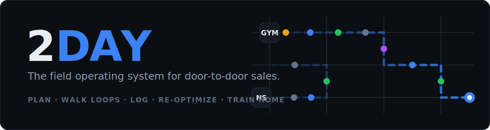
</p>

<p align="center">
  
  
  
  
</p>

**2DAY** compiles a door-to-door sales rep's real constraints — location, end destination, work
hours, train times, bag, gym membership, sales history, preferences — into the most efficient
possible sales day, re-optimizes it live, and now **coaches the rep at the door**: record a
conversation and get the outcome, the objections, and what to improve — instantly, in any
language, without the audio ever leaving the phone.

---

## The working product

This is a running monorepo, not a spec. Screenshots below are captured from the **production
build** of the real app (`assets/screens-app/`). The Plan tab wires to the live planner API with an honest on-device fallback; nudges are driven by the real 15-rule field brain.

| Today | Plan → compiled | Route | Log |
|---|---|---|---|
| 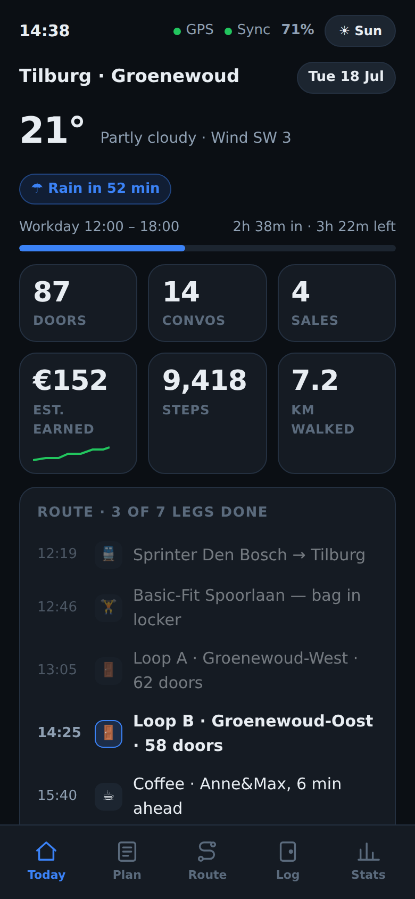 | 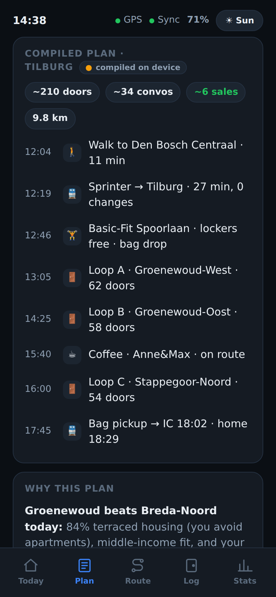 | 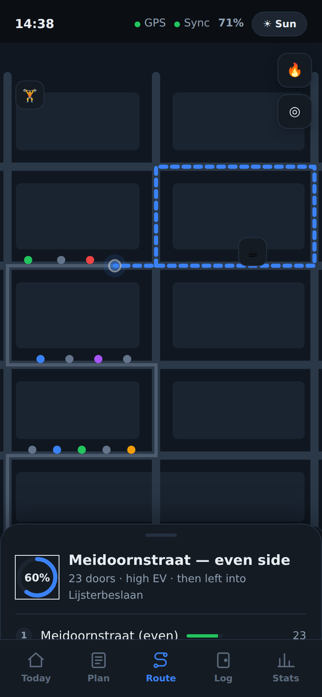 | 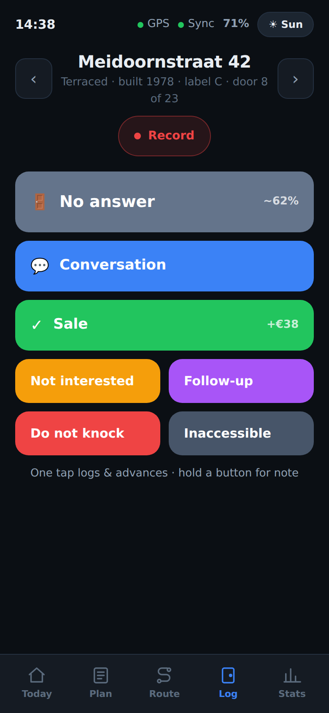 |

| Record at the door | Instant analysis | Stats & coach | Sunlight mode |
|---|---|---|---|
| 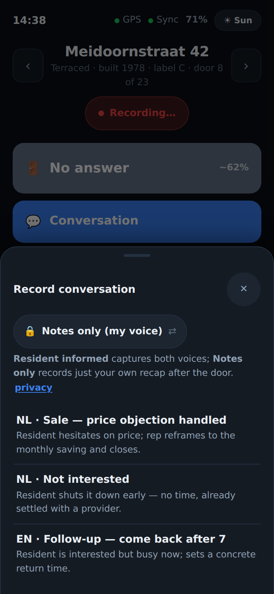 | 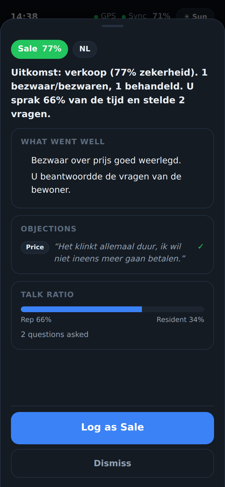 | 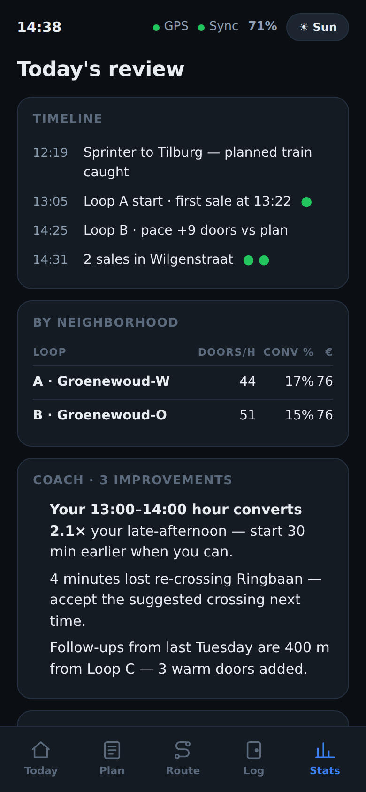 | 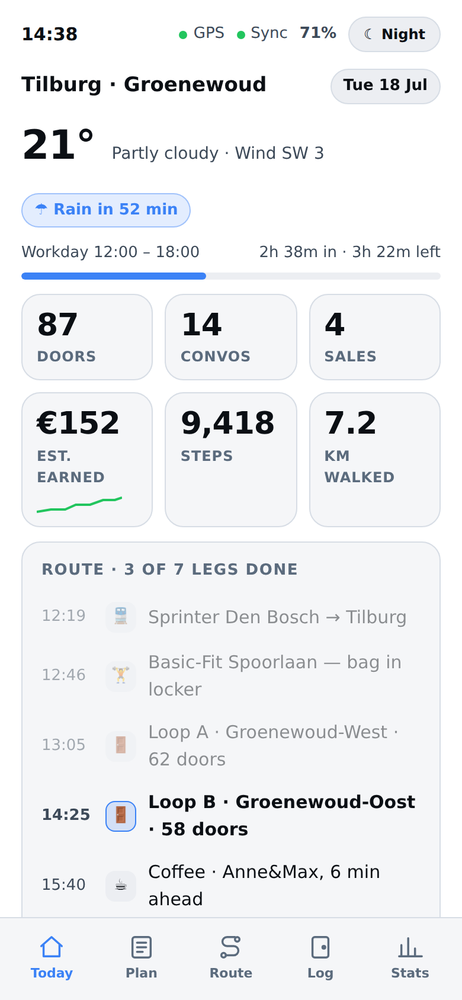 |

```bash
npm install
npm run test          # unit suites: core (EV model, field brain, sync, coach) + planner
npm run test:e2e      # Playwright journey suite — the 13 user stories in e2e/user-stories.md
npm run dev:app       # the five-tab PWA on :3000
npm run dev:planner   # the planning API on :8787
```

Compile a real day against the planner:

```bash
curl -s localhost:8787/v1/plans/compile -H 'content-type: application/json' -d @- <<'EOF'
{ "idempotencyKey":"01J0000000000000000000AAAA", "orgId":"01J0000000000000000000AAAB",
  "repId":"01J0000000000000000000AAAC", "campaignId":"01J0000000000000000000AAAD",
  "goalPreset":"max_sales",
  "location":{"kind":"address","point":{"lat":51.7208,"lng":5.3155},"label":"Maaspoort, Den Bosch"},
  "destination":{"kind":"station","point":{"lat":51.5606,"lng":5.0837},"label":"Tilburg"},
  "hours":{"startAt":"2026-07-18T12:00:00+02:00","endAt":"2026-07-18T18:00:00+02:00"},
  "transportModes":["walk","train"], "memberships":[{"chain":"basic_fit"}],
  "bag":{"size":"standard","canCarryAllDay":false},
  "preferences":{"incomePreference":0.5,"apartmentPreference":-0.6} }
EOF
```

→ 8 feasible legs: walk → Sprinter → Basic-Fit bag drop → canvass loops → bag pickup → IC home,
with expected conversations/revenue and 2 alternatives.

## Doorstep conversation intelligence

Tap **Record** on the Log screen, choose your consent state, talk. The moment you stop:

- **Outcome** classified (sale / not interested / follow-up / conversation) with confidence
- **Objections** with the resident's verbatim words — and whether you handled them
- **Coaching**: what went well, what to improve, grounded in the actual transcript
- **Talk ratio & questions asked** (the doorstep health metrics)
- **Multi-language**: NL · EN · DE · TR · PL per-segment detection; summary translated to your UI language
- **Follow-ups** extract the concrete next step ("come back after 7 — my wife decides")

**Privacy is structural, not a promise** ([doc 21](docs/21-conversation-intelligence.md)):
transcription happens on-device, raw audio is deleted the moment a transcript exists
(`audioRetained` is literally the type `false` on the wire), only transcripts + analysis sync,
and "Notes only" mode records your own voice recap, never the resident. Works fully offline via
the deterministic analyzer; the Claude coach adds nuance when online ([doc 10](docs/10-ai-architecture.md)).

## Tested the way a rep uses it

The Playwright suite drives the production build through the **13 user stories** in
[`e2e/user-stories.md`](e2e/user-stories.md) — open app mid-shift, compile a day, accept, follow
the route, one-tap log with undo, record a conversation in another language, log the analyzed
outcome, flip to sunlight mode, install as PWA, accessibility floor (48 px targets). CI runs
typecheck + 54 unit tests + build + the journey suite on every push.

## How it thinks

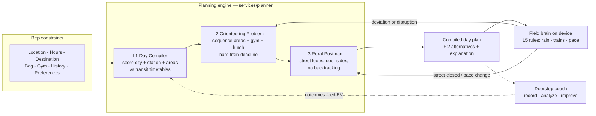

Every knock and every analyzed conversation feeds the expected-value model (Beta shrinkage,
90-day decay — `packages/core/src/ev.ts`), so tomorrow's plan is smarter than today's.

## System architecture

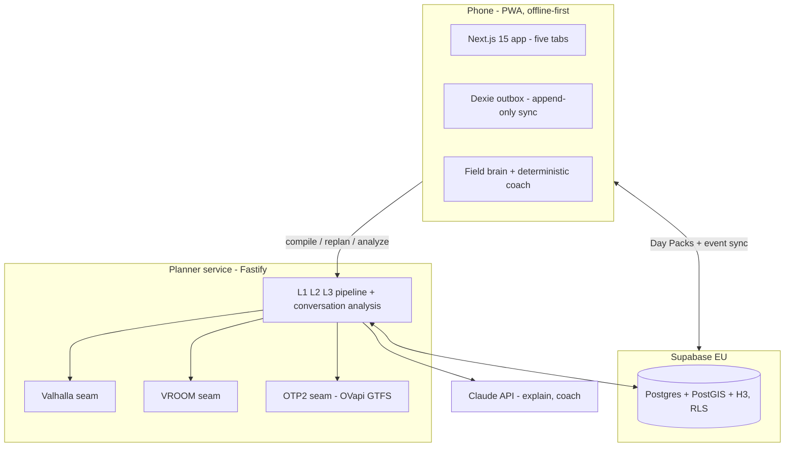

The routing adapters are deterministic mocks today, shaped exactly like the real services
(Valhalla / VROOM / OpenTripPlanner 2) they swap for — see
[doc 09](docs/09-api-architecture.md) and [doc 13](docs/13-public-transport-integration.md).

## Built on open source

| Component | Role | License |
|---|---|---|
| [Next.js](https://github.com/vercel/next.js) · [React](https://github.com/facebook/react) | App framework, PWA | MIT |
| [MapLibre GL JS](https://github.com/maplibre/maplibre-gl-js) + [PMTiles](https://github.com/protomaps/PMTiles) | Maps + offline tile packs | BSD-3 |
| [Valhalla](https://github.com/valhalla/valhalla) | Walking matrices, isochrones | MIT |
| [VROOM](https://github.com/VROOM-Project/vroom) | Route optimization (L2) | BSD-2 |
| [OpenTripPlanner 2](https://github.com/opentripplanner/OpenTripPlanner) | Dutch transit over OVapi GTFS | LGPL |
| [H3](https://github.com/uber/h3) · [PostGIS](https://github.com/postgis/postgis) | Spatial index + truth | Apache-2 / GPL-2 |
| [Supabase](https://github.com/supabase/supabase) | Auth, Postgres, Realtime, RLS | Apache-2 |
| [Dexie.js](https://github.com/dexie/Dexie.js) · [Workbox](https://github.com/GoogleChrome/workbox) | Offline store + SW caching | Apache-2 / MIT |
| [Fastify](https://github.com/fastify/fastify) · [zod](https://github.com/colinhacks/zod) · [Turf.js](https://github.com/Turfjs/turf) | API, validation, geometry | MIT |
| [Playwright](https://github.com/microsoft/playwright) · [Vitest](https://github.com/vitest-dev/vitest) | Journey + unit testing | Apache-2 / MIT |

Plus Dutch open data: **BAG** (every address), **CBS** (demographics), **EP-Online** (energy
labels), **OVapi** (all transit operators, realtime), **KNMI/Buienradar** (rain nowcast),
**PDOK** (geocoding) — pipelines in [doc 12](docs/12-gis-strategy.md).

## The design package behind it

The product is built against a complete venture-grade spec — start at
**[docs/00-design-decisions.md](docs/00-design-decisions.md)**:

| Product | Engineering | Business |
|---|---|---|
| [01 Vision](docs/01-product-vision.md) · [02 Personas](docs/02-user-personas.md) · [03 Journeys](docs/03-user-journeys.md) · [04 Prioritization](docs/04-feature-prioritization.md) · [05 IA](docs/05-information-architecture.md) · [06 Wireframes](docs/06-mobile-wireframes.md) · [07 UI](docs/07-ui-concepts.md) | [08 Database](docs/08-database-schema.md) · [09 API](docs/09-api-architecture.md) · [10 AI](docs/10-ai-architecture.md) · [11 Routing](docs/11-routing-algorithms.md) · [12 GIS](docs/12-gis-strategy.md) · [13 Transit](docs/13-public-transport-integration.md) · [14 Data model](docs/14-data-model.md) · [15 Offline sync](docs/15-offline-sync.md) · [16 Scalability](docs/16-scalability.md) · [17 Security](docs/17-security-model.md) · [21 Conversation intelligence](docs/21-conversation-intelligence.md) | [18 Costs](docs/18-cost-estimates.md) · [19 Monetization](docs/19-monetization.md) · [20 Roadmap](docs/20-roadmap.md) |

The original interactive design prototype lives in [`prototype/index.html`](prototype/index.html)
(design-reference screenshots in `assets/screens/`); the database DDL assembled from doc 08 is in
[`supabase/migrations/`](supabase/migrations/).

<p align="center"><sub>Fieldkit design system · Night &amp; Sun · one thumb, in sunlight, offline · audio never leaves the phone</sub></p>
