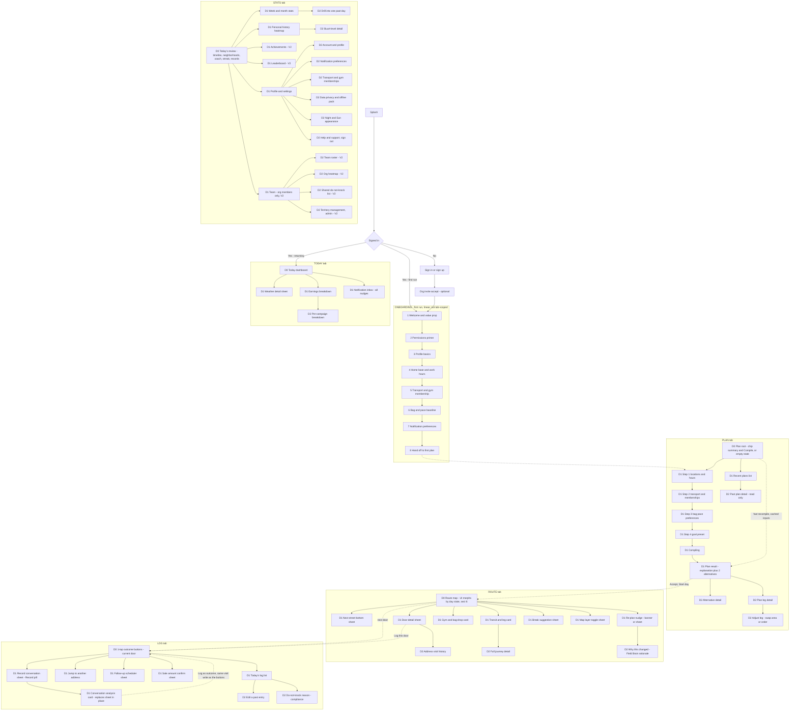
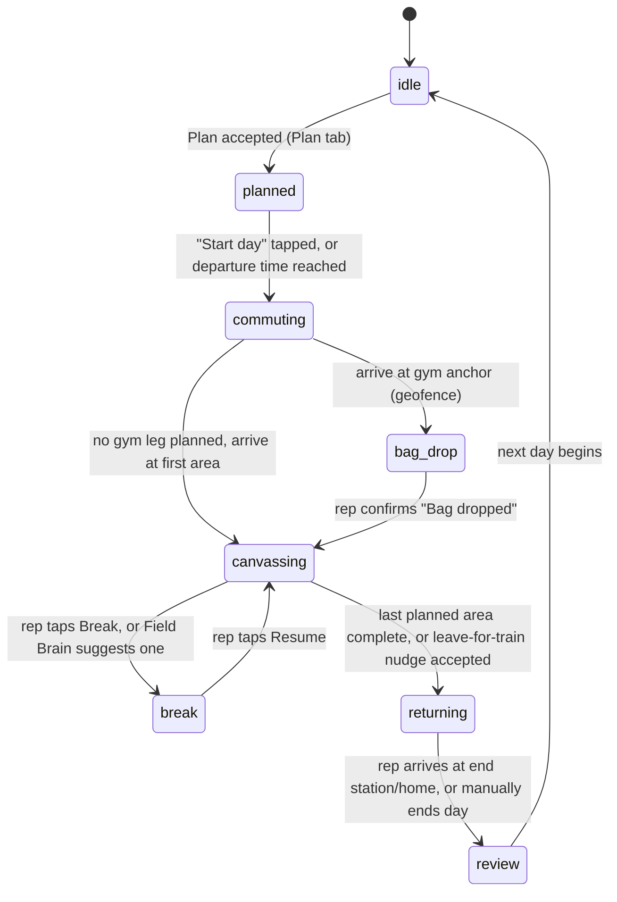

# 2DAY — Information Architecture

> Elaborates `00-design-decisions.md` §2 (principles), §6 (data model), §8 (tabs, tokens).
> Ground-truths screen content against `prototype/index.html`, the working click-through —
> where the prototype already shows a concrete screen, this document formalizes and extends it
> rather than inventing a competing layout. No tab, token, or entity name is redecided here.

## 1. Scope and conventions

**Depth counts navigational destinations, not transient UI.** A destination is a screen or sheet with its own substantive content that a rep can arrive at and linger on. It does **not** include confirmation dialogs, the undo snackbar, action-sheet pickers (date/time), long-press context menus, or a sheet's own internal tab/segment switch — those are "in place" interactions that don't add depth even though something new appears on screen.

- **D0** — a tab's root screen (what you see the instant you tap the tab).
- **D1** — one tap from a D0 (a sheet, a wizard, a detail view).
- **D2** — one tap from a D1. This is the floor. Nothing in 2DAY is D3.
- **Field-critical rule:** anything a rep needs *while actively canvassing* — logging a door, reading the next street, checking the train, seeing a rain nudge — must live at D0 or D1. D2 is reserved for things a rep looks at before or after the working block (adjusting a plan leg, drilling into a past day, editing a setting), never mid-loop.
- Cross-tab jumps (e.g., "Log this door" from a Route pin) are navigation, not depth — they reset the depth counter because they land on another tab's own D0/D1.
- The map's floating utility buttons (heat overlay, center-on-me) and the persistent status strip (clock, GPS, sync, battery, Night/Sun) are **global chrome**, not corner *navigation* — §8's "no top-corner actions" bans back/menu chrome in corners, not ambient status or in-place map tools that don't change screens.

## 2. Full sitemap

## 3. Tab-by-tab IA

### 3.1 Today — "how is my day going, what do I do next"

Purpose: the ambient dashboard. Reps land here between doors and at the start/end of the day.
Primary action: none persistent — this is a reading screen; the closest thing to an action is
tapping the state banner to jump into Route, or a nudge card's single button.

| Screen | Depth | One tap away from | Notes |
|---|---|---|---|
| Today dashboard | D0 | — | Content and hero label change by day-state, §6 |
| Weather detail sheet | D1 | tapping temp/rain pill | Hourly bars, radar last-known frame |
| Earnings breakdown | D1 | tapping earnings stat | Per-campaign split |
| Per-campaign breakdown | D2 | Earnings breakdown | Commission model per `campaign` |
| Notification inbox | D1 | tapping the bell/last-nudge card | Every nudge ever shown today, persisted |

### 3.2 Plan — "compile today"

Purpose: turn constraints into a plan. Two entry paths reconcile the brief's request for a full step-by-step wizard with the prototype's fast one-screen recompile:
- **First plan, or "Edit inputs":** the full 4-step wizard (locations+hours → transport+memberships → bag+pace+preferences → goal preset) → Compiling → Result.
- **Returning rep, inputs unchanged:** Plan root shows the last input set as a chip row (matches `prototype/index.html`'s `#screen-plan` exactly) with a single **Compile day** button — this is the 30-second re-plan the core loop (§2) promises. "Edit inputs" from here re-enters the wizard.

Primary action: **Compile day** (root) → **Accept · download Day Pack** (result).

| Screen | Depth | Primary action | Notes |
|---|---|---|---|
| Plan root | D0 | Compile day / Start wizard | Empty state if no inputs saved yet |
| Wizard steps 1–4 | D1 | Next | Linear, replaces in place — not additive depth |
| Compiling | D1 | — | Server L1+L2 (§5); non-interactive, ~1–2 s |
| Plan result | D1 | Accept · download Day Pack | Explanation (Sonnet) + top plan + 2 alternatives |
| Alternative detail | D2 | Swap to this plan | Read-only preview before committing |
| Plan leg detail | D2 | Adjust leg | Tap any leg row for its EV/time breakdown |
| Adjust leg | D2 | Confirm swap | Manual override of one leg only (§9.3 principle: app decides, rep can override) |
| Recent plans | D1 | — | Read-only list, tap → Past plan detail (D2) |

### 3.3 Route — "where am I, what's next" (the map)

Purpose: live spatial awareness. This is the tab whose *content*, not just its sheets, changes shape by day-state — detailed in §6. Primary action is state-dependent (Start day / Bag dropped / Resume), never more than one persistent button.

| Screen | Depth | Reached from | Notes |
|---|---|---|---|
| Route map (state-dependent) | D0 | tab bar | Map fills screen; sheet at bottom, map tools top-right |
| Next-street sheet | D1 | drag/tap the sheet grab handle | Collapsed peek (pace ring + next street) ↔ expanded queue |
| Door detail | D1 | tap a door pin | BAG facts + EV + "Log this door" |
| Address visit history | D2 | Door detail | Past `visit` events at this `address_unit` |
| Transit/leg card | D1 | tap the transit anchor pin, or auto-shown | GTFS-RT live |
| Full journey detail | D2 | Transit/leg card | All remaining legs to end station |
| Gym/bag-drop card | D1 | tap the gym pin, or auto-shown at anchor | Locker/shower attributes |
| Re-plan nudge | D1 | Field Brain trigger (banner) or tap for detail (sheet) | §7 |
| Why this changed | D2 | Re-plan sheet | Auditable template text, §9.3 |
| Break suggestion | D1 | tap Break, or Field Brain suggests | Nearby coffee/toilet/water POIs |
| Map layer toggle | D1 | tap a map tool button | Rain radar, personal heatmap, do-not-knock overlay |

### 3.4 Log — "one tap, keep walking"

Purpose: the single most-used screen in the product. Full detail (buttons, sizing, haptics) in `06-mobile-wireframes.md`. Primary action **is** the screen — 7 outcome buttons, with the address context bar above them and exactly one piece of chrome between the two: the **Record** pill (`app/src/components/coach/CoachRecorder.tsx`, mounted between `AddressScrubber` and `OutcomeButtons` in `app/src/app/log/page.tsx`) — the entry point to the doorstep conversation coach (`21-conversation-intelligence.md`). It is a single 48 px pill, not a card, so it never competes with the buttons for the fold.

| Screen | Depth | Reached from | Notes |
|---|---|---|---|
| Log (current door) | D0 | tab bar, or "Log this door" from Route | ‹ › stepper in the address bar moves through the *planned sequence* — this does not add depth, it's in-place |
| Record conversation sheet | D1 | tap the Record pill on Log D0 | Consent chip (defaults **Notes only**, doc 21 §2.2) + live capture (timer, Stop), or the always-available samples fallback — full detail `06` §14.1 |
| Conversation analysis card | D1 | automatic, the instant Stop resolves | Replaces the record sheet **in place** (same mount point, same backdrop) — outcome + coaching card stack from the on-device deterministic analyzer (doc 21 §5.1); full detail `06` §14.2 |
| Jump to another address | D1 | rare — logging out of GPS sequence | Search/list of nearby `address_unit`s |
| Follow-up scheduler | D1 | outcome = follow_up | Date/time picker (transient, no added depth) |
| Sale amount confirm | D1 | outcome = sale | Pre-filled from `campaign` commission, editable |
| Today's log list | D1 | swipe up on address bar, or Stats → Timeline link | Every `visit` logged today |
| Edit a past entry | D2 | Today's log list | Correct a mis-tap after the 5-s undo window closed |
| Do-not-knock reason | D2 | Today's log list, or long-press a DNK entry | Compliance note, feeds org-wide do-not-knock (V2) |

**Depth check — the coach flow never exceeds D1.** Record sheet and Analysis card are two states of one mounted component (`CoachRecorder.tsx`'s `stage` machine: `sheet` → `analyzing` → `analysis`), not two sheets stacked on top of one another — the analysis card replaces the record sheet in the same portal exactly the way the Plan wizard's `Compiling` step replaces itself with `Plan result` without adding depth (§3.2). Both therefore sit at **D1** off Log's D0, matching §1's floor rule that field-critical screens live at D0 or D1. "Log as {outcome}" on the analysis card does not navigate anywhere — it calls the identical `logOutcome` the 7 outcome buttons call, writing the same `visit` event, then dismisses back to D0. That reuses the "Today's log list" row's existing **snackbar + 5-s undo** (above; `06` §6.2) — it is not a new nudge, and it does not touch the Field Brain nudge system at all: §7's banner/sheet/push channels carry only the `rain`/`train` nudge kinds (`app/src/lib/store.tsx`), so the coach flow has no nudge of its own to add there.

### 3.5 Stats — "how did I do, and what do I improve"

Purpose: reflection and (V2) motivation. D0 **is** the daily review — matching `prototype/index.html`'s `#screen-stats` structure directly (Timeline → By neighborhood → Coach's 3 improvements → streak → personal records), not a separate sheet behind a summary card. A period chip row (Today / Week / Month) switches the same screen's content in place; it does not add depth. Profile/Settings and (V2) Team sit here rather than under Today, because Stats is already the tab where a rep looks inward — this avoids inventing a 6th tab or a top-corner gear icon, both of which §8 rules out.

| Screen | Depth | Reached from | Notes |
|---|---|---|---|
| Today's review | D0 | tab bar | Default period = today |
| Week/month stats | D1 | period chip, or "View week" link | Doors/h, €/h, conversion % trend |
| Drill into one day | D2 | Week/month stats | Reuses the daily-review layout, read-only |
| Personal history heatmap | D1 | "Heatmap" card link | H3-cell density map of own visits |
| Buurt-level detail | D2 | tap a heatmap cell | Score-cell breakdown, own visit count |
| Achievements (V2) | D1 | streak card link | Badge grid |
| Leaderboard (V2) | D1 | streak card "#N this week" pill | Org/team scoped |
| Profile and settings | D1 | row at the foot of Today's review | Account, notifications, transport/gym, privacy, appearance, help — each D2, each a leaf |
| Team (V2, org members only) | D1 | row at the foot, org members only | Roster, org heatmap, shared do-not-knock, territory (admin) — each D2 |

## 4. Cross-cutting areas

- **Auth:** Splash → Sign in/Sign up (Supabase Auth) → optional org-invite deep link → Onboarding (first run) or straight to Today (returning). Not tab-scoped; no bottom tab bar until Today is reached.
- **Onboarding:** 8 linear screens (sitemap §2), first run only, resumable if interrupted (state persisted locally). Ends by handing off directly into the Plan wizard — the first thing a new rep does with a working app is compile a real day, not stare at an empty dashboard.
- **Settings:** deliberately *not* a 6th tab or a top-corner gear (§8 forbids both). Lives one tap under Stats. Every settings sub-page is a D2 leaf — none links to another settings page, keeping the whole area inside the 2-level budget.
- **Org/team (V2):** visible only to reps whose `rep.org_id` has team features enabled. Same placement logic as Settings — a D1 entry point off Stats, not a new tab, not nested inside Settings (nesting it there would push its sub-pages to D3, breaking the depth rule).

## 5. Today dashboard information hierarchy

Given principle 1 (one thumb, walking, sunlight) and principle 5 (battery as a budgeted resource), Today's data is triaged by **cost to check** versus **urgency to act**, not by importance in the abstract. Battery, for instance, is genuinely important — but it doesn't need a dedicated glance every few seconds, so it does not compete for hero space.

**Global status strip** (all 5 tabs, not just Today): clock, GPS-fix dot, sync dot, battery %, Night/Sun toggle. This is ambient chrome, checked in the corner of the eye, always in the same place — the right answer for battery specifically, which needs to be *visible* without ever needing to be *read*.

**Tier 1 — Glanceable hero** (top ~28% of screen, largest type — 34 px temp per §8 token scale, readable in under a second mid-stride):
- Day-state label + current leg/progress ("Canvassing · Loop B · Groenewoud-Oost")
- Location breadcrumb ("Tilburg · Groenewoud")
- Weather line: temp + condition + wind, one line ("21° · Partly cloudy · Wind SW 3")
- Rain nowcast pill ("☂ Rain in 52 min") — promotes to a Tier-1-equivalent nudge banner when the window closes to under ~20 minutes
- Work-hours progress bar (range, elapsed/remaining, fill track)

**Tier 2 — Stat grid** (3 columns × 2 rows, tabular numerals, 26 px values, scanned in a natural pause — waiting at a door, between houses, ~2–3 s): Doors · Conversations · Sales (+ trend spark) / Est. earnings · Steps · Distance (km). This is deliberately the funnel-plus-effort set, matching the product's primary metric (§1): productive conversations per hour. A rep glances here to answer "am I pacing okay," not "what do I do next" — that's Tier 1's job.

**Tier 3 — Contextual cards** (below the grid, scrollable, read during a real pause — gym bag-drop, coffee break, start/end of day — not mid-stride):
- Route progress card: ordered leg list with done/now states (mirrors `plan_leg` sequence)
- Next-train card: platform, live status, countdown-to-leave-by — the single most important Tier-3 card, because missing a train reorders the whole rest of the day
- Disruptions card: calm "no disruptions" state by default; becomes the active alert + triggers a banner nudge the moment a `disruption_event` touches the rep's planned line
- Weather detail (D1, reached by tapping the Tier-1 weather line): full hourly forecast, last radar frame

| Brief data point | Tier | Form | Promotion rule |
|---|---|---|---|
| Location | 1 | breadcrumb | — |
| Weather now (temp, condition) | 1 | inline text | — |
| Wind | 1 | inline text, same line as weather | — |
| Rain forecast | 1 (chip) / 3 (hourly detail) | countdown pill / hourly bars sheet | chip escalates to a banner nudge at <20 min |
| Work hours | 1 | progress bar | — |
| Battery | global chrome | status strip | <15%: strip icon turns warn-amber; no separate card |
| Steps | 2 | stat cell | — |
| Distance | 2 | stat cell | — |
| Doors | 2 | stat cell | — |
| Conversations | 2 | stat cell | — |
| Sales | 2 | stat cell + spark | a new sale also fires a brief Tier-1 haptic/toast, §7 |
| Est. earnings | 2 | stat cell | — |
| Current/remaining route | 1 (state label) + 3 (leg-list card) | short text / full card | — |
| Time until train | 3 (card) / 1-equivalent (banner) | countdown card / nudge | <15 min to required leave-by |
| Disruptions | 3 (card) / 1-equivalent (banner + push) | status card / nudge | any active `disruption_event` on the rep's line |

## 6. Day lifecycle state machine

Any state can trigger a re-optimization (rain, disruption, pace, closed street) **without** changing the day-state — re-plans mutate `plan`/`plan_leg` rows per the §5 re-optimization rules; they are not themselves transitions. Transitions are a mix of automatic (geofence, GTFS-RT, elapsed time) and manual (an explicit button), consistent with principle 3: the app decides, the rep can override.

| Day state | Route tab content | Default bottom sheet | Primary button | Today hero |
|---|---|---|---|---|
| idle | Empty map, home base marker | none | "Plan today" → Plan tab | "No plan yet — plan your day" |
| planned | Full route overview, all legs as a line | Plan leg list (read-only) | Start day | Plan summary + countdown to departure |
| commuting | Walking-to-station directions + live train position | Journey card | (auto-advances) | "Commuting → [area], train on time" |
| bag_drop | Gym pin centered | Gym card (locker/shower) | Bag dropped, start canvassing | "At [gym] — drop bag" |
| canvassing | Walking map, door pins colored by outcome | Next-street sheet (collapsed peek by default) | none persistent — Log tab is the action | Full 3-tier dashboard (§5) |
| break | De-emphasized map, nearby POIs | Break timer sheet | Resume canvassing | "On break — Nm" |
| returning | Reversed commuting view, urgency framing | Journey card, "leave now" emphasis | (auto-advances) | "Heading to [end], train in Nm" |
| review | Faded, read-only recap of the walked route | none, map frozen | View Daily Review → Stats tab | Daily review teaser |

## 7. Notification and nudge IA

**Channels** (mirrors `prototype/index.html`'s implemented `.nudge` and `.offline` components):

1. **In-app banner** — bottom-anchored, above the tab bar, one accent- or warn-colored left border, title + one line of body + **one** action button. Auto-dismisses after 9 s if ignored (matches the prototype's `showNudge` timer). This is the default channel for almost every Field Brain nudge — "never present >3 choices" (principle 3) is easily satisfied by a single accept-or-ignore action.
2. **Sheet** — a full bottom sheet, used only when a nudge carries a genuine choice between ≥2 concrete alternatives (e.g., "which loop to move up," not just "re-plan yes/no"). Reached by tapping into the banner's body/title, not its action button. Still capped at 3 buttons.
3. **Push** — OS-level, used when the app is backgrounded/screen-locked, or redundantly alongside a P0 in-app banner for anything genuinely time-critical.

**Priority rules**, referencing the Field Brain (§9.3 examples — rain nudge, train nudge, door-access skip nudge):

| Tier | Examples | Channel | Behavior |
|---|---|---|---|
| P0 Critical | Leave-by in <5 min; severe weather warning | Push always + banner (warn/amber) if foreground | Preempts any nudge on screen; supersedes, does not queue behind it |
| P1 Actionable | Rain in <20 min changes the best next loop; transit disruption needs a re-route; pace has drifted enough to threaten the train | Banner (foreground) / push (backgrounded) | Tapping escalates to the Sheet if ≥2 real alternatives exist |
| P2 Advisory | Skip a street (low EV/access — "78% apartments"); minor pace deviation; gym locker likely full | Banner only, no push | Auto-dismiss, always logged to the Notification inbox |
| P3 Passive | Streak milestone, achievement unlocked (V2), daily review ready | Tab badge + inbox entry only | Never interrupts |

Only one interrupt (banner or sheet) is visible at a time. The Field Brain runs its nudges through a priority queue: a higher-priority nudge preempts a lower one already on screen (the displaced one returns to the inbox, it is not lost); same-tier nudges are debounced (minimum ~90 s gap) so the rep is never spammed — a direct extension of principle 5's "budget attention like a resource." Every nudge, regardless of channel, is written to the Today → Notification inbox (§3.1), so channel controls interruption strength only, never persistence.

## 8. Empty, error, and offline states per screen

Per principle 4, offline is a **mode**, not a failure — offline states use neutral/informational styling (matches the prototype's amber-but-calm `.offline` strip: "OFFLINE — 12 EVENTS QUEUED · MAPS & PLAN CACHED"), never red/alarm styling. Error states, by contrast, are reserved for things that are actually broken and need a retry.

| Screen | Empty state | Error state | Offline state |
|---|---|---|---|
| Today | First run: dashboard replaced by "Plan your first day" CTA | Cached snapshot shown + "Last updated Nm ago" + retry banner | Cached snapshot + persistent top strip, neutral tone, no red |
| Plan | No saved inputs: wizard opens directly, no chip-summary shortcut | Compile timeout/failure: "Couldn't compile a plan" + retry, falls back to last successful alternative if one exists | Wizard steps 1–4 work fully offline (cached BAG/CBS/gym data); the *compile* step needs connectivity — shown as "Will compile when back online," not as an error, since planning tomorrow is not a mid-walk field-critical action |
| Route | No plan (idle): empty map + home-base marker + CTA to Plan | Tile/GPS fetch failure: falls back to the last cached Day Pack tile, "Map data may be outdated" badge | Day Pack covers map, doors, and on-device L3 re-order fully; live-only layers (train position, rain radar) show a "last known Nm ago" staleness badge instead of failing |
| Log | No door context: "Pick an address to log" prompt | Local write failure (should not happen — Dexie is local-first): storage-full warning + guidance | Always fully functional offline — every `visit` is an append-only local event; a "N visits queued to sync" badge shows until connectivity returns |
| Stats | Day 1, no history: "Finish your first day to see stats" | Aggregate query failure: last cached stats + retry | Today's stats compute on-device from the local event log; Week/heatmap/leaderboard (server-aggregated) show a stale-data badge if last synced while offline |
