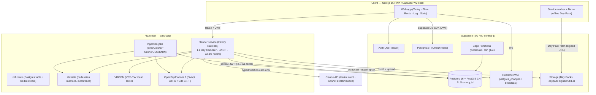

# 2DAY — API & Service Architecture

> Elaborates the canonical decisions in `00-design-decisions.md` §3, §5, §7. Two API surfaces:
> **Supabase PostgREST** for RLS-guarded CRUD-ish reads/writes, and a **dedicated planner service
> (Fastify on Fly.io)** for all compute. The planner never touches the database directly for
> tenant data without going through the same RLS boundary the client uses. AI is a compiler, never
> an oracle (§9) — no endpoint here lets an LLM emit a route or a score.

## 1. Service topology



**Rules of the topology**
- The client talks to exactly two backends: **Supabase** (auth, reads, realtime, storage) and the
  **planner service** (compute). No third origin in the field.
- The planner is **stateless**; all durable state lives in Postgres. Horizontal scale = add Fly
  machines. In-flight compile jobs are owned by a row, not a process (§4).
- Valhalla / VROOM / OTP2 are **internal-only** on the Fly private network (`.internal` / 6PN).
  They are never exposed to the client; the client never learns they exist.
- Claude API is reachable only from the planner service, never from the browser. No Anthropic key
  ships to the client.

## 2. Which surface owns what

| Concern | Surface | Why |
|---|---|---|
| Read `area`, `score_cell`, `poi`, `campaign`, `gym_membership`, own `visit`/`plan` history | **PostgREST** | Row-level reads, RLS does tenanting, cache-friendly, no bespoke code |
| Write `visit`, GPS breadcrumbs, session marks | **Client → Dexie outbox → PostgREST batch upsert** (see doc 15) | Append-only events, idempotent, offline-first |
| Mutate settings, plan tweaks | **PostgREST** (LWW-per-field) | Small mutable set, doc 15 §LWW |
| Compile / re-plan / discover areas / build Day Pack / nudges | **Planner service** | CPU-bound, long-running, calls Valhalla/VROOM/OTP2/Claude — must not run in Edge Functions (§3 brief) |
| Realtime plan/nudge/disruption push | **Supabase Realtime** (broadcast) + **planner SSE** | Split by lifetime & payload (§6) |

Heuristic: **if it reads a row, it goes through PostgREST; if it computes, it goes through the
planner.** The planner may *read* via PostgREST-equivalent SQL but only writes `plan`, `plan_leg`,
job rows, and Day Pack artifacts.

## 3. Planner service — endpoint catalog

Base URL `https://planner.2day.app`. All routes require a Supabase JWT (§8). All responses are
`application/json` except SSE. `v1` is path-versioned (§5).

| Method | Path | Purpose | Sync/Async |
|---|---|---|---|
| `POST` | `/v1/plans/compile` | L1→L2→L3 full compile → `Plan` | Async (job) |
| `GET` | `/v1/plans/:planId` | Fetch a compiled plan (+legs, +alternatives) | Sync |
| `POST` | `/v1/plans/:planId/replan` | Incremental re-plan from a live signal | Async (fast) |
| `GET` | `/v1/plans/:planId/status` | Poll compile/replan job state | Sync |
| `GET` | `/v1/areas/discover` | Feasible (city, station, area-set) candidates for a location/time | Sync (cached) |
| `POST` | `/v1/daypack/:planId` | Build offline Day Pack → signed URL | Async (job) |
| `GET` | `/v1/nudges/stream` | Field-brain nudges + replan pushes (SSE) | Streaming |
| `POST` | `/v1/plans/:planId/legs/:legId/ack` | Rep accepted/overrode a leg (feeds re-plan) | Sync |
| `GET` | `/v1/health` / `/v1/ready` | Liveness / readiness (deps: Valhalla/OTP/VROOM/PG) | Sync |

### 3.1 `POST /v1/plans/compile`

The heart of the API. Body is the full `PlanRequest` (every L1 input from the brief §5).

```ts
type ULID = string;              // 26-char Crockford base32
type ISODateTime = string;       // RFC3339, always with offset, e.g. 2026-07-18T07:40:00+02:00
type H3Index = string;           // res 9–10 cell
type GoalPreset =
  | "max_sales" | "easy_day" | "highest_income" | "shortest_walking" | "explore";
type TransportMode = "walk" | "train" | "bus" | "tram" | "metro" | "bike" | "car";
type BagSize = "none" | "light" | "standard" | "heavy"; // heavy ⇒ gym drop strongly preferred

interface GeoPoint { lat: number; lng: number; }

interface LocationInput {
  /** Where the rep starts. `current` = live GPS; `station`/`address` = explicit. */
  kind: "current" | "station" | "address";
  point: GeoPoint;
  /** PDOK/BAG id or GTFS stop id when kind ≠ current; helps snap to a real anchor. */
  ref?: string;
  label?: string;                // "Den Bosch Centraal"
}

interface WorkHours {
  startAt: ISODateTime;          // earliest the rep can knock
  endAt: ISODateTime;            // hard: must be at destination by (or before) this
  breaks?: { earliest: ISODateTime; latest: ISODateTime; minutes: number }[]; // lunch window (soft)
}

interface MembershipInput {
  chain: string;                 // "basic_fit" | "anytime_fitness" | ...
  gymMembershipId?: ULID;        // resolves to gym_membership row for locker/shower attrs
  /** If omitted, planner uses all POIs of matching chain within reach as bag-drop candidates. */
}

interface Preferences {
  /** 0..1 weight nudging toward higher-income buurten (CBS). max at 1. */
  incomePreference: number;
  /** −1..1. −1 = avoid apartments (locked portiek/no door access), +1 = seek high-density. */
  apartmentPreference: number;
  walkingSpeedMps?: number;      // measured pace; default 1.35 m/s, personalized from history
  maxWalkMinutes?: number;       // soft cap on total walking
}

interface PlanRequest {
  idempotencyKey: ULID;          // client-generated; dedupes retried compiles (§4)
  orgId: ULID;                   // must match JWT claim; server re-checks
  repId: ULID;
  campaignId: ULID;              // what is being sold (commission model → EV)
  goalPreset: GoalPreset;        // selects the L1 weight vector
  location: LocationInput;       // start
  destination: LocationInput;    // where the day must end (train home, home address…)
  hours: WorkHours;
  transportModes: TransportMode[]; // modes the rep will actually use today
  memberships: MembershipInput[];  // gyms usable as bag lockers / showers
  bag: { size: BagSize; canCarryAllDay: boolean };
  preferences: Preferences;
  /** Optional overrides — never required. Absent ⇒ planner defaults from history/priors. */
  overrides?: {
    pinnedAreas?: ULID[];        // "I want to work Maaspoort no matter what"
    excludedAreas?: ULID[];
    maxAlternatives?: number;    // default 2 (brief: top plan + 2 alternatives)
  };
}
```

Response is `202 Accepted` with a job handle (compiles routinely exceed the <3 s soft budget for
cold L1; §4). The eventual `Plan`:

```ts
type LegKind = "transit" | "walk" | "gym" | "canvass" | "break";

interface PlanLeg {                 // 1:1 with plan_leg entity (§6)
  id: ULID;
  seq: number;
  kind: LegKind;
  startAt: ISODateTime;
  endAt: ISODateTime;
  fromLabel: string;
  toLabel: string;
  areaId?: ULID;                    // set for canvass legs (CBS buurt)
  geometry?: string;                // encoded polyline (walk/canvass loop), server-simplified
  detail: TransitLegDetail | CanvassLegDetail | GymLegDetail | Record<string, never>;
}

interface TransitLegDetail {
  mode: Exclude<TransportMode, "walk">;
  routeShortName: string;           // "IC 3600" | "bus 156"
  fromStopId: string; toStopId: string;
  scheduledDepart: ISODateTime; scheduledArrive: ISODateTime;
  realtimeState: "on_time" | "delayed" | "cancelled" | "unknown";
}

interface CanvassLegDetail {
  areaId: ULID;
  h3Cells: H3Index[];
  streetEdgeIds: ULID[];            // the L3 required-edge set
  expectedConversations: number;    // Σ EV over the loop
  doorCount: number;
  estWalkMinutes: number;
}

interface GymLegDetail { poiId: ULID; action: "drop_bag" | "shower" | "pickup_bag"; }

interface PlanScore {
  expectedConversations: number;
  expectedRevenueEur: number;       // Σ EV × commission
  walkMinutes: number; transitMinutes: number; carryPenalty: number;
  goalPreset: GoalPreset;
}

interface PlanAlternative {
  id: ULID;
  label: string;                    // "More sales, +18 min walk"
  score: PlanScore;
  deltaVsChosen: string;            // human one-liner; the explainer (doc 10) fills tone
  legs: PlanLeg[];
}

interface Plan {                    // 1:1 with plan entity (§6)
  id: ULID;
  orgId: ULID; repId: ULID; campaignId: ULID;
  goalPreset: GoalPreset;
  compiledAt: ISODateTime;
  planVersion: number;              // bumps on each replan; monotonic
  validUntil: ISODateTime;          // transit slice staleness horizon
  score: PlanScore;
  legs: PlanLeg[];
  alternatives: PlanAlternative[];  // ≤ 2 by default
  explanation?: string[];           // 3 sentences from Sonnet (doc 10); may arrive after legs
  daypackStatus: "none" | "building" | "ready";
}
```

### 3.2 `POST /v1/plans/:planId/replan`

Incremental re-plan on a live signal. The brief's re-optimization contract: **L3 always, L2 if
>15 min deviation, L1 only on user request.** The endpoint honors that; it never silently
re-runs L1.

```ts
interface ReplanRequest {
  idempotencyKey: ULID;
  reason: "rain_nowcast" | "transit_disruption" | "pace_behind" | "pace_ahead"
        | "street_closed" | "manual_tweak";
  signal: {
    at: ISODateTime;
    atPoint?: GeoPoint;             // current position
    rainStartsInMin?: number;       // KNMI/Buienradar
    disruptionEventId?: ULID;       // GTFS-RT alert already ingested
    closedStreetEdgeIds?: ULID[];
    paceDeltaMin?: number;          // + = behind schedule
  };
  allowLevel: "L3" | "L2" | "L1";   // ceiling; server may use a lower level
}
// → 202 + job handle; result is a new Plan with planVersion++ and a replanKind field on the job.
```

Replans target a **<3 s server-side budget** and always emit a degraded-safe result: if VROOM/OTP
time out, the planner returns the best incumbent with a `degraded: true` flag rather than nothing.
The **on-device L3 re-order** (doc 15) is the offline mirror of this endpoint.

### 3.3 `GET /v1/areas/discover`

Fast, cacheable candidate generation for the Plan tab before a full compile. Pure L1 scoring, no
VROOM/OTP heavy solve — used to render the "where to work today" list.

```
GET /v1/areas/discover?lat=51.69&lng=5.30&startAt=...&endAt=...&modes=train,walk&goal=max_sales
```
```ts
interface AreaCandidate {
  areaId: ULID; buurtCode: string; name: string;        // "Maaspoort, 's-Hertogenbosch"
  centroid: GeoPoint;
  reachMinutes: number;                                  // OTP2 door-to-area estimate
  expectedConversationsPerHour: number;
  incomeIndex: number; apartmentShare: number;           // CBS-derived, for preference filters
  score: number;                                         // goal-weighted L1 score
}
interface AreasDiscoverResponse {
  generatedAt: ISODateTime;
  cacheKey: string;                                      // {lat,lng,timeslot,modes,goal} hash
  candidates: AreaCandidate[];                           // ranked
}
```
Cached at res-9 H3 origin × 30-min timeslot × goal for ~10 min (transit-slice bound). Cache hit
target keeps this endpoint sub-200 ms.

### 3.4 `POST /v1/daypack/:planId`

Builds the offline Day Pack (doc 15 owns the manifest/format) and returns a **Supabase Storage
signed URL**. Async because PMTiles extraction is I/O heavy.

```ts
interface DaypackBuildRequest { idempotencyKey: ULID; force?: boolean; } // force ⇒ rebuild
interface DaypackBuildResult {
  planId: ULID;
  manifestVersion: number;
  sizeBytes: number;                // must be < 25 MB (doc 15)
  signedUrl: string;                // Supabase Storage, TTL 15 min
  expiresAt: ISODateTime;
  sha256: string;
}
```

### 3.5 `GET /v1/nudges/stream` (SSE)

Server-Sent Events carrying field-brain nudges (doc 10 §field brain) and replan-ready pushes for
the active plan. SSE (not WS) because the stream is **server→client only**, survives proxies, and
auto-reconnects with `Last-Event-ID`.

```
GET /v1/nudges/stream?planId=...  Accept: text/event-stream  Authorization: Bearer <jwt>
```
```
event: nudge
id: 01J8...ULID
data: {"kind":"rain","template":"rain_before_loop","text":"Rain in 22 min — do the Zuid loop first","legHint":"...","ttlSec":300,"priority":80}

event: replan_ready
id: 01J8...ULID
data: {"planId":"...","planVersion":4,"reason":"transit_disruption"}

event: heartbeat
data: {"at":"2026-07-18T09:12:00+02:00"}
```
The field brain runs **on-device** (deterministic, offline-capable); this stream is the *online*
path used to (a) deliver Sonnet-toned rewrites of a template and (b) push server-side replan
completions. When offline, the client emits the same nudges from raw templates and ignores the
stream until reconnect (arbitration in doc 10 keeps it ≤ 1 nudge / 2 min regardless of source).

## 4. Async pattern, idempotency, versioning, errors

**Job model.** Compile / replan / daypack are jobs. `POST` returns `202` + a job handle. The job
is a **row** (`plan_job` table: `id, org_id, kind, state, plan_id, idempotency_key, progress,
result, error, created_at`) plus a Redis stream for worker pickup, so any Fly machine can own it
and a crash re-queues it. States: `queued → running → succeeded | failed | degraded`.

```ts
interface JobHandle { jobId: ULID; kind: "compile"|"replan"|"daypack"; state: JobState;
                      pollAfterMs: number; }             // client backs off per this hint
type JobState = "queued" | "running" | "succeeded" | "failed" | "degraded";
```

Two ways to learn a job finished: **poll** `GET /v1/plans/:id/status` (cheap, always available,
the offline-tolerant default) or subscribe to the **nudges SSE** `replan_ready` / a `compile_ready`
event (push, online only). Poll is authoritative; SSE is an accelerator.

**Idempotency.** Every mutating `POST` carries a client `idempotencyKey` (ULID) *and* accepts the
standard `Idempotency-Key` header (header wins if both present). The planner stores
`(org_id, idempotency_key) → jobId` for 24 h; a repeat returns the **same** `JobHandle` — a retried
compile from a flaky field connection never spawns a second solve. This is the server-side twin of
the append-only outbox's event-id dedupe (doc 15).

**Versioning.** Path-versioned (`/v1`). Additive fields are non-breaking and ship without a bump;
removing/retyping a field or changing an enum's meaning requires `/v2` with ≥90-day dual-run. The
`Plan.planVersion` counter is *per-plan* (increments on replan) and is orthogonal to API `/v1`.

**Error taxonomy.** One envelope, stable machine codes:

```ts
interface ApiError {
  code: string;            // stable, machine-readable
  message: string;         // human, never localized field text (no prompt-injection surface)
  requestId: ULID;
  retryable: boolean;
  details?: Record<string, unknown>;
}
```

| HTTP | `code` | When | Retryable |
|---|---|---|---|
| 400 | `PLAN_REQUEST_INVALID` | Schema/type failure on `PlanRequest` | no |
| 401 | `AUTH_MISSING` / `AUTH_INVALID` | No/expired JWT | no (re-auth) |
| 403 | `ORG_MISMATCH` | JWT `org_id` ≠ body `orgId` | no |
| 404 | `PLAN_NOT_FOUND` | Unknown/foreign plan id (RLS-masked as 404) | no |
| 409 | `IDEMPOTENCY_REPLAY_MISMATCH` | Same key, different body | no |
| 422 | `INFEASIBLE_PLAN` | No candidate satisfies hard constraints (deadline/daylight/gym hours) | no |
| 429 | `RATE_LIMITED` | Bucket exhausted; `Retry-After` set | yes |
| 503 | `ROUTING_DEP_UNAVAILABLE` | Valhalla/VROOM/OTP2 down; degraded result may accompany | yes |
| 504 | `SOLVE_TIMEOUT` | Solve exceeded budget; incumbent returned as `degraded` | yes |

`INFEASIBLE_PLAN` returns the *nearest-feasible* relaxation in `details` (e.g. "latest workable
end 17:40, you asked 17:15") so the Plan tab can offer a fix instead of a dead end.

## 5. Realtime channels vs SSE vs polling

Three transports, chosen by payload lifetime and origin:

| Transport | Carries | Origin | Why not the others |
|---|---|---|---|
| **Supabase Realtime — `postgres_changes`** | New `disruption_event` rows for the rep's active corridor; `campaign` changes; org `do_not_knock` additions | DB row change | DB-truth fan-out, RLS-filtered, no planner load |
| **Supabase Realtime — `broadcast`** | Team presence (lead sees reps live, V2), leaderboard ticks | Ephemeral | No need to persist; DB-changes would be write-amplification |
| **Planner SSE (`/v1/nudges/stream`)** | Field-brain nudges (toned), `replan_ready`, `compile_ready` | Compute events | Server→client only, reconnect via `Last-Event-ID`, no DB round-trip |
| **Polling (`/status`, outbox flush)** | Job completion (authoritative), sync push/pull | Client-driven | Works offline-intermittent; the field default when WS/SSE can't hold |

Channel naming: `org:{org_id}:disruptions`, `plan:{plan_id}:presence`. RLS + Realtime
authorization policies gate every subscription on `org_id` from the JWT — a rep cannot subscribe to
another org's channel.

**Design stance:** realtime is an accelerator, never a correctness dependency. Every realtime fact
is also reachable by a poll or the next Day Pack refresh, because the field is offline by default
(design principle §2.4).

## 6. Auth: request, service-to-service, rate limits

**Request auth (client → planner).** The client attaches the **Supabase JWT** (`Authorization:
Bearer`). The planner verifies it *locally* against Supabase's JWKS (cached, rotated) — no network
hop per request. It extracts and trusts only signed claims:

```ts
interface TwoDayJwtClaims {
  sub: ULID;               // rep id (auth.users.id)
  org_id: ULID;            // custom claim, set at signup/invite
  role: "rep" | "lead" | "admin";
  exp: number; iat: number;
}
```
The planner **re-checks** `org_id`/`repId` in the body against the token (defense in depth; the
token is authoritative). Every DB access the planner makes uses a **request-scoped Postgres role
with the caller's `org_id` set** (`SET LOCAL request.jwt.claims`), so **the same RLS policies apply
to the planner as to the browser** — the planner has no god-mode read path to tenant data. See
doc 08 for the policy bodies; doc 17 for the threat model.

**Service-to-service (planner ↔ Valhalla/VROOM/OTP2).** Internal Fly 6PN private network only,
`*.internal` DNS, no public routes. mTLS between planner and routing engines; a shared, rotated
service token as a second factor. Ingestion jobs write with a dedicated service role scoped to the
reference tables (`area`, `address_unit`, `score_cell`, `street_edge`, `poi`) — never to
tenant-owned `visit`/`plan`.

**Planner → Claude & → Storage.** Anthropic key and Storage service key live only in Fly secrets,
never in the client bundle. Day Pack delivery is a **short-TTL signed URL** (15 min), so the
Storage key never leaves the server.

**Rate limiting.** Token-bucket per `(org_id, rep_id)` at the planner edge, plus a coarse per-org
ceiling:

| Endpoint | Per-rep limit | Burst | Notes |
|---|---|---|---|
| `POST /plans/compile` | 20 / hour | 5 | Idempotency-keyed retries don't recount |
| `POST /plans/:id/replan` | 60 / hour | 10 | Field re-plans are frequent by design |
| `GET /areas/discover` | 120 / hour | 20 | Cache absorbs most |
| `POST /daypack/:id` | 10 / hour | 3 | Heavy; `force` counts double |
| `GET /nudges/stream` | 3 concurrent | — | One active plan ⇒ ~1 stream |

Over-limit ⇒ `429 RATE_LIMITED` + `Retry-After`. PostgREST reads are governed by Supabase's own
limits; abusive read patterns are additionally shaped at the CDN. Claude API spend is capped per
org per day at the planner (doc 10 cost model) — exhausting it degrades to raw templates, never a
failed field action.
