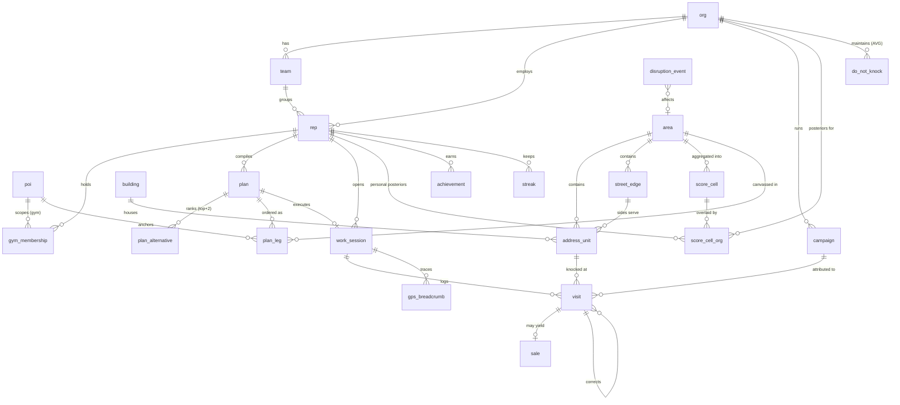

# 2DAY — Logical Data Model

> The narrative layer above the DDL (doc 08) and the GIS pipelines (doc 12). Elaborates
> `00-design-decisions.md` §5–§7 and §11. Covers the entity-relationship overview, aggregate
> lifecycles, the append-only `visit` event taxonomy, the EV feature vector and its Bayesian update,
> data provenance, and per-entity privacy classification.

## 1. Entity-relationship overview

Three families: **reference geodata** (shared, from open data), **tenant operations** (planning +
execution, `org_id`-scoped), and **derived scoring** (H3 base + per-tenant overlay).



Cardinality notes: a `visit` references at most one `address_unit` (NULL for off-BAG knocks, geom
always present); a `sale` references its originating `visit` softly (no FK to the partitioned table,
doc 08 §8); `score_cell_org` has one org-level row (`rep_id IS NULL`) plus one row per rep who has
history in the cell.

## 2. Aggregate lifecycles

### 2.1 Plan compilation (L1 → L2 → L3)

1. Rep states intent ("easy day, end in Tilburg by 18:00"). Haiku parses it into a typed
   `PlanRequest` (brief §9.1) stored in `plan.request`; `plan.status = 'draft'`.
2. **L1 Day Compiler** enumerates (city, station, area-set) candidates, scoring each with the EV model
   (§3) and OTP2 transit costs. Top candidate becomes the `plan`; the top-3 are written to
   `plan_alternative` (rank 0 = chosen). Sonnet writes the 3-sentence explanation into
   `plan_alternative.summary`.
3. **L2 Orienteering** sequences anchors + areas into ordered `plan_leg` rows (transit / gym bag-drop /
   canvass / break), honoring the `departure_train_at` hard deadline.
4. **L3 arc-routing** fills each `canvass` leg's `payload.arc_route_edges` (the per-side street loop)
   and `geom`. `plan.status = 'compiled'`, `compiled_at` set.
5. The Day Pack is sliced (doc 12 §4–5) and cached on-device.

### 2.2 Execution

On "Start", a `work_session` opens (`plan.status = 'active'`). Each door is one **1-tap** `visit`
append (brief §2). Background GPS emits `gps_breadcrumb`. The on-device Field Brain (brief §9.3)
consumes breadcrumbs + rain nowcast + GTFS-RT and fires re-optimization: L3 re-order locally, L2/L1
server-side per the brief §5 thresholds. Re-plans rewrite `plan_leg` but never touch logged visits.

### 2.3 Session close

On "End day", `work_session.ended_at`/`end_geom` set, `closed = true`, `plan.status = 'completed'`.
A close job computes `work_session.summary` (doors, conversations, sales, €/h, km, productive
conversations/hour — the primary metric, brief §1), advances `streak`/`achievement`, and triggers an
**incremental** personal `score_cell_org` posterior update for the cells worked today.

### 2.4 Analytics

The nightly learning loop (brief §9.5, SQL + a small Python job) recomputes `score_cell.ev_prior`
from the newest open-data snapshot and org-level `score_cell_org` posteriors over all history with
90-day decay (§3). The daily/weekly Coach (Sonnet) narrates `work_session.summary` aggregates into a
review + 3 concrete improvements. None of analytics mutates the `visit` stream.

## 3. The EV feature vector & posterior update

The expected value of a door (brief §5) factorizes as:

```
EV(door) = P(answer | time, dwelling, history)
         × P(conversation | answer, campaign fit)
         × P(sale | conversation, demographics fit)
         × commission(campaign)
```

**Feature inputs**, by source, flowing into `score_cell` and the per-door computation:

| Feature | Source | Entity/column |
|---|---|---|
| dwelling type, build year, surface, unit count | BAG | `address_unit.gebruiksdoel/oppervlakte`, `building.bouwjaar` |
| ownership %, rental %, income band, household size, %65+ | CBS | `area.*`, rolled to `score_cell.income_band/ownership_pct` |
| energy label (per door + buurt mix) | EP-Online | `address_unit.energy_label`, `score_cell.label_mix` |
| solar % | CBS solar | `area.solar_pct` |
| answer/conversation/sale history | `visit` stream | `score_cell_org` α/β + counts |
| time-of-day, day-of-week | derived at scoring | request context |
| campaign fit | `campaign.target_filter` vs features | join at scoring |

**Priors.** `ev_prior` comes from a model trained on features → historical outcomes across the org
network (regularized logistic/GBM offline). It is the fallback where a cell has little local history.

**Posteriors (Bayesian shrinkage).** Each probability factor is a **Beta-Binomial**. For P(answer) in
a cell, the posterior mean shrinks the local rate toward the prior with pseudo-counts:

```
P̂(answer) = (α₀ + a) / (α₀ + β₀ + n)
  where (α₀, β₀) encode the prior at prior strength k = α₀ + β₀   (e.g. k = 20 knocks-equivalent)
        a = decayed answers,  n = decayed knocks in the cell
```

A cell with 3 local knocks stays close to the prior; a cell with 400 knocks is driven by local
truth. `score_cell_org` stores α/β directly so the update is an O(1) increment per visit.

**90-day half-life decay (brief §5).** History ages continuously; on each recompute we decay the
pseudo-counts before adding new evidence, so a knock's weight halves every 90 days:

```
λ = ln(2) / 90d
a  ← a · e^(−λ·Δt) + new_answers
n  ← n · e^(−λ·Δt) + new_knocks
```

with `Δt = now − decayed_at`, then `decayed_at ← now`. This is applied in the nightly loop (org-level,
`rep_id IS NULL`) and on session close (personal, per-rep rows). Doors/hour predictions combine BAG
door spacing (geom), the rep's learned `walking_speed_mps`, and per-outcome dwell-time distributions
from `visit.dwell_seconds`.

## 4. The `visit` event stream — taxonomy & immutability

`visit` is the product's ledger: an **append-only stream of immutable door facts** (brief §6/§7).
Correctness of every EV posterior, streak, and payout depends on it never being silently mutated.

### 4.1 Outcome semantics

| `visit_outcome` | Meaning | Counts toward |
|---|---|---|
| `no_answer` | Knocked, nobody opened | attempt; denominator of P(answer) |
| `conversation` | Door opened, real exchange | answer + conversation; the **primary metric** numerator |
| `sale` | Closed a deal | answer + conversation + sale; spawns a `sale` row |
| `not_interested` | Opened, declined fast | answer, non-conversation |
| `follow_up` | Come-back-later (schedule in V2) | answer; seeds a follow-up task |
| `do_not_knock` | Explicit refusal / AVG opt-out | answer; **suppresses future routing**, materialized to `do_not_knock` |
| `inaccessible` | Locked hall, gated, no access | attempt, non-answer; feeds "78% apartments locked" nudges (brief §9.3) |

### 4.2 Immutability rules

- **No UPDATE, no DELETE.** There are deliberately no RLS UPDATE/DELETE policies on `visit`
  (doc 08 §10). The only write is INSERT.
- **Idempotent replay.** `(device_id, client_seq)` is unique; the ULID PK is client-minted. Re-syncing
  the same offline event is a no-op upsert (brief §7) — no conflicts by construction.
- **Corrections are new events.** A mis-tapped outcome is fixed by inserting a `visit` with
  `op = 'correction'` and `corrects_visit_id` = the original's id (carrying the right outcome). The
  original row stays as historical fact.
- **Tombstones.** A visit logged in error (wrong house entirely) gets an `op = 'tombstone'` event
  referencing it; the original + tombstone both persist, the effective state drops it.
- **Effective state** is a view, not the base table — the latest non-tombstoned event per logical door
  visit:

```sql
create view visit_effective as
select distinct on (coalesce(corrects_visit_id, id))
       coalesce(corrects_visit_id, id) as logical_id, v.*
from visit v
where v.op <> 'tombstone'
  and not exists (select 1 from visit t
                  where t.op = 'tombstone' and t.corrects_visit_id = coalesce(v.corrects_visit_id, v.id))
order by coalesce(corrects_visit_id, id), v.occurred_at desc;
```

All analytics, posteriors, and payouts read `visit_effective`; the raw `visit` table is the
tamper-evident audit log.

## 5. Data quality & provenance

### 5.1 Refresh cadence & versioning

| Source | Cadence | Snapshot version | Consumer |
|---|---|---|---|
| BAG | full monthly (+ daily mutations V2) | extract date `bag-2026-07-08` | `building`, `address_unit` |
| CBS Wijken & Buurten | annual | `cbs-2025` | `area`, `score_cell` features |
| EP-Online | monthly | `ep-2026-07` | `address_unit.energy_label`, `score_cell.label_mix` |
| OSM (Geofabrik) | weekly | pbf timestamp | `street_edge`, Valhalla graph |
| OVapi / NDW / KNMI | live (minutes) | ingest time | `disruption_event` |

Every reference row carries its `snapshot_version`; open-data snapshots are retained (object storage)
so any prior state is reproducible and an ingest can be rolled back by re-pointing the version.

### 5.2 Propagating a BAG update without breaking history

The risk: BAG renumbers, splits, or retires a `verblijfsobject`, which would orphan visits keyed to
it. Mitigations:

- **Stable surrogate key.** Visits reference `address_unit.id` (our surrogate), never the volatile
  `vbo_id`. A new BAG snapshot updates attributes on the *same* `id` where the `vbo_id` persists.
- **Lifecycle mapping.** BAG `voorkomen` (life-cycle) records let the merge map an old `vbo_id` to its
  successor(s). Split → one old id maps to N new units; the merge keeps the old `id` as the primary
  successor and back-links the rest, so historical visits stay attributed to a live door.
- **Versioned features, immutable facts.** `score_cell.ev_prior` recomputes on each snapshot, but
  logged `visit` outcomes never change — posteriors re-derive cleanly because decay + counts are a
  function of the immutable stream, not of current BAG geometry.
- **Validation gate.** The ingest's stage→validate step rejects a snapshot that would drop >X% of
  units (guards a corrupt/partial extract), so a bad BAG release can't silently erase doors.

## 6. Privacy classification (GDPR / AVG posture)

Per brief §11: consent-first GPS, on-device precision reduction before org sharing, do-not-knock as a
compliance feature, EU-only residency. Classification drives retention, RLS, and anonymization.

| Entity | Class | Notes |
|---|---|---|
| `rep` | **personal** | Identifiable staff. RLS to self + org admin; profile export/erase on request. |
| `gym_membership` | **personal** | Tied to a rep. |
| `device` | **personal** | Push token + platform; pseudonymous device id. |
| `visit` | **pseudonymous** | No resident PII stored (outcome only); links rep↔address. Org sharing is aggregated to `score_cell` grain, never raw per-door. Rep owns the stream (RLS). |
| `gps_breadcrumb` | **personal** (sensitive) | Precise location trail. Consent-gated, **90-day retention**, precision-reduced (H3 res 9) before any org visibility. |
| `sale` | **personal** | Contract reference + amounts; financial, restricted to rep + org admin. |
| `work_session` | **pseudonymous** | Aggregates; identifiable only via `rep_id`. |
| `do_not_knock` | **personal** (compliance) | A resident's opt-out. Held **because** AVG/ordinance requires honoring it; minimized to `address_unit_id` + reason, never resident identity, honored org-wide. |
| `plan` / `plan_leg` / `plan_alternative` | **pseudonymous** | Rep's intent + route; RLS to owner. |
| `achievement` / `streak` | **pseudonymous** | Gamification, per rep. |
| `score_cell_org` (rep rows) | **pseudonymous** | Personal posteriors; RLS to self. |
| `score_cell_org` (org rows) | **aggregate** | k-anonymized: a cell surfaces org-wide only above a minimum knock count so no single rep/resident is re-identifiable. |
| `score_cell` (base) | **aggregate** | Open-data-derived; no personal data. |
| `area` / `building` / `address_unit` / `street_edge` / `poi` | **aggregate / public** | Open data (BAG/CBS/OSM/EP-Online). `address_unit` is a public address, not a resident. |
| `campaign` | **business** | Commercial config, org-confidential (not personal data). |
| `disruption_event` | **public** | Open transit/roadworks/weather feeds. |

Anonymization rule of thumb: anything crossing from a rep's own view to an **org** view is reduced to
H3 aggregate grain with a minimum-count threshold, and raw `gps_breadcrumb` never leaves the personal
scope. This is the schema-level enforcement of the brief §11 posture.
